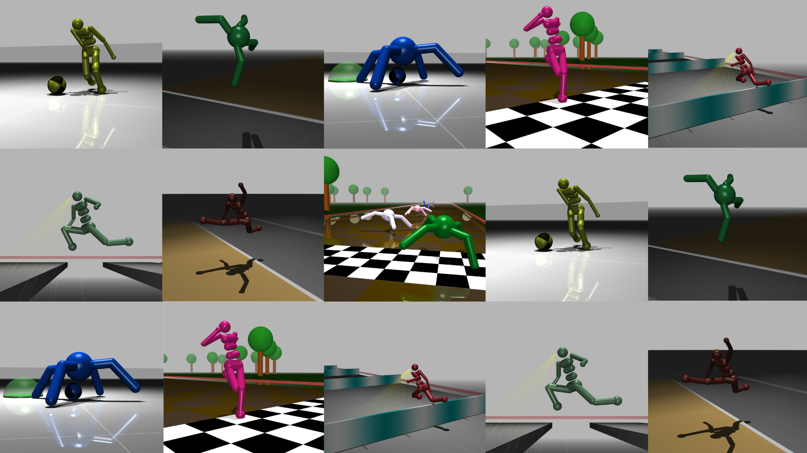

<div align="center">
  <h1>🏃 Sports Hub</h1>
</div>

<div align="center">
  
</div>

<br/>

<p align="center">
  <a href="https://i1cps.github.io/Sports-Hub-Website/"><strong>🔗 Check out the website for live demo's here</strong></a>
</p>


**Sports Hub** is a simple collection of clean, high-performance **Locomotion MJX environments** built for training reinforcement learning agents using [**Brax**](https://github.com/google/brax) + [**JAX**](https://github.com/google/jax).

> 🚀 Plug in, pick an environment, and watch your agent go.


## 📦 Features

- ⚡ Ultra-fast training with JAX + Brax
- 🎮 Easy-to-run, modular MJX environments
- 🔁 Reproducible with RNG seed control
- 🎬 Sample trained agents to visualize behavior
- 🛠 Built to extend: plug in your own logic, bodies, and control


## 🌍 Supported Environments

| Environment    | Description                                  | Status | Docs 🧍                                              | Docs 🐜                                               |
| -------------- | -------------------------------------------- | ------ | ---------------------------------------------------- | ----------------------------------------------------- |
| `sprint`       | Agent sprinting across a race track          | 🟢     | [📄](./sports_hub/environments/sprint_humanoid/readme.md)   | [📄](./sports_hub/environments/sprint_quadruped/readme.md)   |
| `longjump`     | Agent attempting the long jump field event   | 🟢     | [📄](./sports_hub/environments/longjump_humanoid/readme.md) | [📄](./sports_hub/environments/longjump_quadruped/readme.md) |
| `gaps`         | Agent jumps across a platform of gaps        | 🟢     | [📄](./sports_hub/environments/gaps_humanoid/readme.md)     | ➖   |
| `hurdles`       | Agent sprints and jumps over hurdles         | 🟢     | [📄](./sports_hub/environments/hurdles_humanoid/readme.md)   | ➖                                                    |
| `fetch`        | Agent fetches a ball and brings it to target | 🟢     | [📄](./sports_hub/environments/fetch_humanoid/readme.md)    | [📄](./sports_hub/environments/fetch_quadruped/readme.md)                                                    |
| `ball dribble` | Agent dribbles a soccer ball to the finish   | 🟣✨   | ➖                                                   | ➖                                                    |

**Legend:** 🟢 Fully supported  🟣✨ Coming Soon  🧍 Humanoid Variant  🐜 Quadruped Variant


## ⚡ Quickstart

Clone the repo and set up your environment:

```bash
git clone https://github.com/i1Cps/sports-hub.git
cd sports-hub 

python3 -m venv env
source env/bin/activate
```

### 🧠 Install JAX

Choose **one** of the following based on your system:

- **If you have a GPU (faster):**

  ```bash
  pip install jax[cuda12]
  ```

- **If you don't have a GPU (CPU only):**

  ```bash
  pip install jax
  ```

### 📦 Install the rest of the dependencies

```bash
pip install -r requirements.txt
```

###  Install VLC

```bash
sudo apt install vlc
```

### 🚀 Run an example agent

```bash
python3 -m sports_hub.inference --env=sprint_humanoid --rng=3 --num_agents=5
```

> 🧪 Swap `--env=` with any supported task  
> 🧪 Use `--num_agents` to control how many agents are spawned (⚠️running more than one agent can destabilize the simulation)  
> 🧪 Use `--rng` for different seeds


## 📦 Dependencies

[](https://mujoco.readthedocs.io/en/stable/overview.html)
[](https://docs.jax.dev/en/latest/quickstart.html)
[](https://flax-linen.readthedocs.io/en/latest/)
[](https://www.nvidia.com/en-gb/geforce/drivers/)


## 🙏 Credits

Developed by [**Theo Moore-Calters**](https://www.linkedin.com/in/theo-moore-calters/)

[](https://github.com/i1Cps)
[](https://linkedin.com/in/theo-moore-calters)

#### Special thanks to

[](https://ludaprojects.com/) [](https://mujoco.org/)

## 📜 License

This project is licensed under the MIT License.  
See the [LICENSE](./LICENSE) file for details.
